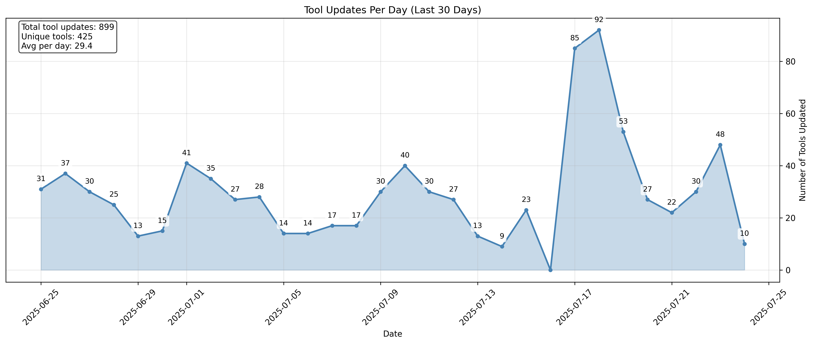

# mise-versions

stores version numbers of common mise plugins

## Tool Update Analysis

This repository tracks tool updates through git history analysis. The chart below shows the daily number of tool updates over the last 30 days.

### Daily Tool Updates (Last 30 Days)

*Timeline showing the number of tools updated each day over the last 30 days*
